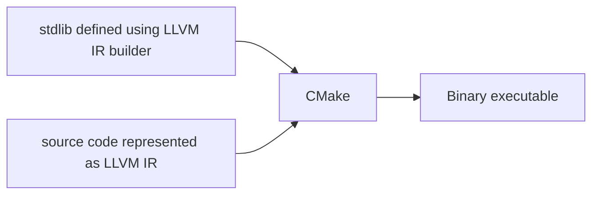
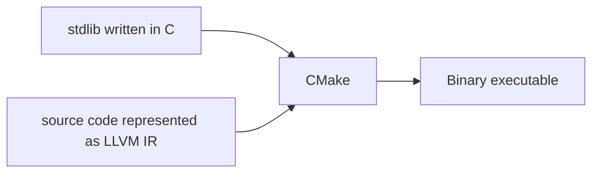

# stc

Compiler for llvmscript, an attempt to compile TypeScript into native machine code.

Goal: Compile TypeScript PI calculator into a native ELF LSB pie executable

### Developing

Dependencies: `llvm` `cmake`

On macOS you may need to run this for llvm-bindings to be able to find llvm.

```shell
export PATH="/opt/homebrew/opt/llvm/bin:$PATH"
export LDFLAGS="-L/opt/homebrew/opt/llvm/lib"
export CPPFLAGS="-I/opt/homebrew/opt/llvm/include"
```

Getting LLVM generated code from a c file:

```
llvm-gcc -S -emit-llvm llvm/hello-world.c -o /dev/stdout
```

## Development Notes

### Variables & Types

[TODO]

### Runtime

The runtime is implemented in C, and gets compiled into the resulting binary.

The runtime could also be implemented in LLVM IR, but it would be stupid to do so because you'd need to do everything manually. Why go through all that pain when it's already been done for you?

Although the runtime library is implemented in C, it gets "translated" into LLVM IR as well, and that is the basis for this compiler. This means that you'd need to interface with the runtime library through the equivalent LLVM calls that you'd do as if it was an LLVM IR file.

How it looks like before:



How it looks like now:



As you can see, CMake accepts both LLVM IR and C/C++ code, which means we wouldn't need to re-invent the wheel if we were to do the same thing with the LLVM IR Builder. C comes with a plethora of builtins we can use, resulting in a standard library that's a lot easier to write and maintain.

### Why

what better way to learn more about compilers than to actually build one
